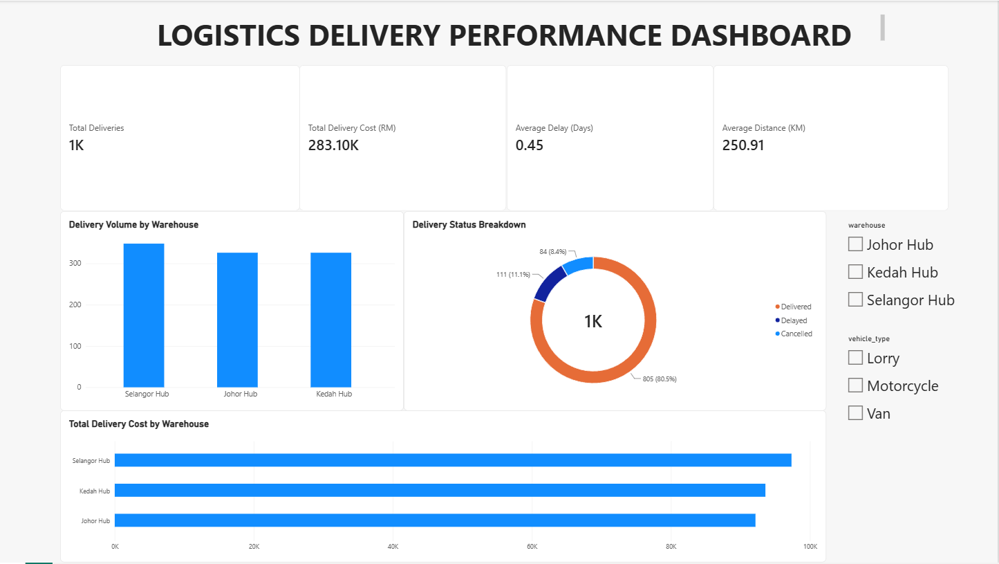

# Logistics Delivery Performance Dashboard

## Project Overview
This is a personal Power BI portfolio project using simulated logistics delivery data.

The objective of this project is to transform logistics data into an interactive dashboard that provides a clear overview of delivery volume, logistics costs, delivery delays, travel distance, delivery status, and warehouse performance.

## Tools Used
- Microsoft Power BI
- Power Query
- Data Visualization
- Interactive Slicers
- CSV Dataset

## Dataset
The dataset contains 1,000 simulated logistics delivery records.

Key fields include:
- Delivery ID
- Order Date
- Warehouse
- Destination
- Vehicle Type
- Distance (KM)
- Weight (KG)
- Promised Delivery Date
- Actual Delivery Date
- Delivery Status
- Delay Days
- Delivery Cost (RM)

## Dashboard KPIs
The dashboard highlights four main performance indicators:

- Total Deliveries: 1,000
- Total Delivery Cost: RM283.10K
- Average Delay: 0.45 Days
- Average Distance: 250.91 KM

## Dashboard Analysis
The dashboard includes:

- Delivery Volume by Warehouse
- Delivery Status Breakdown
- Total Delivery Cost by Warehouse
- Warehouse Filter
- Vehicle Type Filter

## Key Insights
- Selangor Hub recorded the highest delivery volume with 348 deliveries.
- Delivered orders represented 80.5% of the 1,000 delivery records.
- Selangor Hub recorded the highest total delivery cost at approximately RM97.34K.
- Users can interactively filter the dashboard by warehouse and vehicle type.

## Dashboard Preview

## Skills Demonstrated
- Power BI Dashboard Development
- Power Query
- Data Preparation
- KPI Development
- Logistics Data Analysis
- Data Visualization
- Interactive Dashboard Design
- Business Insight Generation

## Project Files
- `Logistics_Delivery_Performance_Dashboard.pbix` - Complete interactive Power BI dashboard
- `PowerBI_Logistics_Dashboard.png` - Dashboard preview
- `logistics_delivery_data.csv` - Simulated logistics dataset

## Note
This project was created for portfolio purposes using simulated data and does not represent data from a real company.
